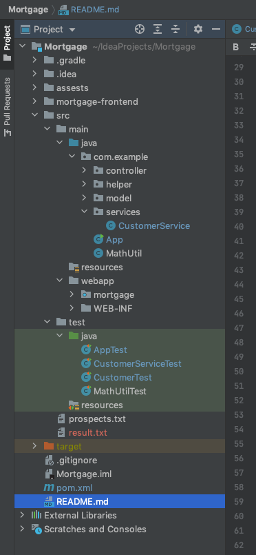
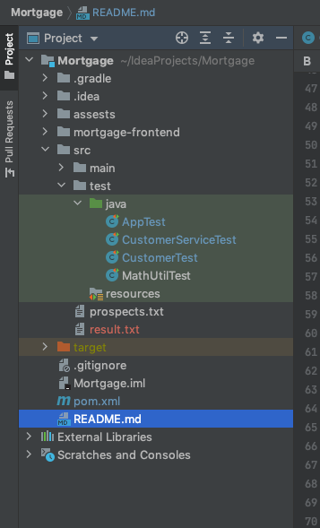
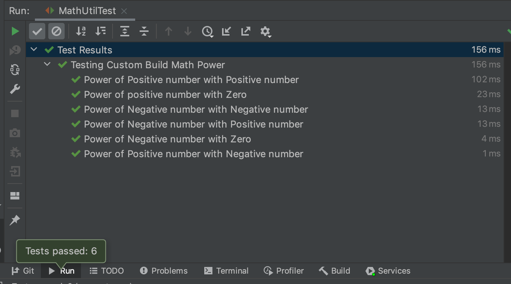
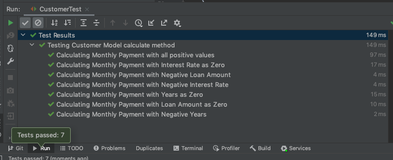
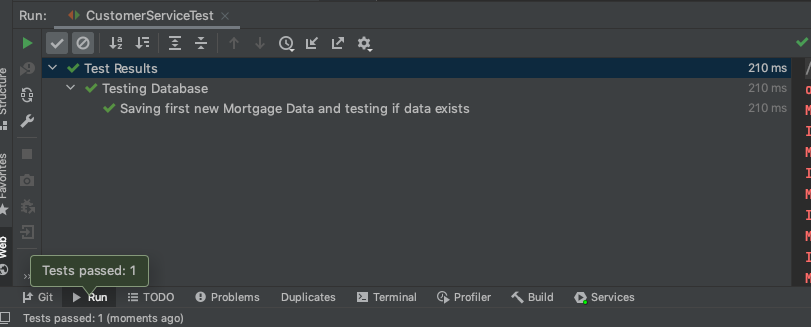
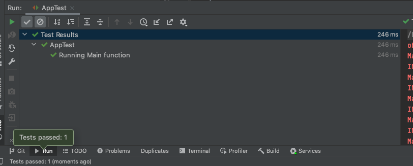

# Mortgage Web application
Simple Mortgage application build using Java and react which helps users get to know the amount of **monthly payment** that has to be paid in order to pay the **loan** they want to borrow.
Users have to simply enter **Loan Amount, Interest rate, Years** along with their **Name** to get the amount easily.
For web interface React is used as Front-end.

## Tools Used
- **Front-end : React**
- **Server : Tomcat 9.0.44**
- **JDK : jdk1.8.0_144.jdk**
- **Build plugin : Maven**
  - **maven-war-plugin**
  - **version 3.3.0**
- **Testing :**
  - **JUnit**
    - **version 5.7.0**
- **IDE : IntelliJ IDEA**

## Dependencies
- **Servlet :**
  - **javax.servlet-api**
    - **version 4.0.1**
- **Database :**
  - **MongoDB**
    - **mongo-java-driver**
        - **version 3.12.8**
- **Testing :**
  - **JUnit**
    - **junit-jupiter-api**
    - **junit-jupiter-engine**
    

## Project Structure

 
## How To run the project
  Let's discuss how you can run the project in your local machine.
   ### 1. **Clone the project**

     git clone https://github.com/shivachit1/Mortgage.git
  ### 2. **Open the Project with IDE**
  I am using Intellij IDEA IDE for development and maven to build this project and run it. So I will talk how to build and run using it. 

  ### 3. **Download Tomcat Server**
  I am using **Tomcat 9.0.44** as a server for this application. So in order to run this application you have to download and configure your tomcat server to the project.
  You can download the tomcat 9 through below link.
  <https://tomcat.apache.org/download-90.cgi>
  
  Try downloading the tomcat suitable for your machine. I am using macOS, so I downloaded **tar.gz** and unzip it to my local machine.

  ### 4. **Configure Your Tomcat Server**
  In order to integrate Tomcat Server in your project, you need to add configuration in your project. I suppose you have already opened the project using Intellij IDEA.
Now the steps after that: 
  1. Click on your **RUN** menu from a window and click on **Edit Configurations...**.
     Dialog Box will pop up. 
  2. Click on **'+'** on top-left and select **Local** in **Tomcat server**.
      
      
     
      
      
  3. After that configuration tab for tomcat local will open. Now, You have to configure the **application server** for the project.
     Here Click on "configure" button on your side and give the path of a recently downloaded tomcat unzipped folder.
      
      
     
      
      
     
  4. IDE will update your configuration as in above image. If the setting are different, try to change as shown in picture above.
    Important things to note:
     
    URL: http://locahost:8080/mortgage**
    JRE: 1.8 SDK**
    HTTP port: 8080**
  5. There will a warning saying "No artifacts marked for deployment". Click on right side button "Fix" and select "Mortgage:war exploded".
      
      
     
      
      
     
  6. Click OK Button. Your tomcat server is configured. Now Run you tomcat server. 
     To run this go to top nav button and select tomcat as shown in below picture and click on run button.
      
      
      
     
      
      
      
  7. Now you are running your server successfully on your local machine.

### 5. **MongoDB database**
 1. We are using mongodb as our database. If you have mongo db already installed in your local machine then run you mongo db, 
    incase if you haven't installed mongo db before then go to this link https://docs.mongodb.com/guides/server/install/ to download and run your mongo db in your local machine.
    
 2. After you have installed Mongo db on you local machine, run your mongodb using terminal or command. 
     
    Hoping your mongo db is running in
   
        mongodb://localhost:27017

### 6. **Redeploy the changes to your Tomcat server**
 1. Now you can see the server is restarted and browser is opened with url http://locahost:8080/mortgage
         
     
     
     
    
     
     
     
 2. Now you can fill the form and click calculate button. it will give you the results.
     
 3. You can also see the mongo database creates a new database **mortgage** and saved the data in **customers** collection.

# Testing the application
All the testing files are located in src/test/java folder.
 You can run testing for this application by running java file inside src folder as shown in the picture.

### 1. Math power test cases. (MathUtilTest.java)

   - **First Test was to check if the MathUtil.power method returns 22 as 4.**
   - **Second Test was to check if the MathUtil.power method returns 20 as 1.**
   - **Third Test was to check if the MathUtil.power method returns -2-2 as 0.25.**
   - **Forth Test was to check if the MathUtil.power method returns -22 as 4.**
   - **Fifth Test was to check if the MathUtil.power method returns -20 as 1.**
   - **Sixth Test was to check if the MathUtil.power method returns 2-2 as 0.25.**

### 2. Customer class calculate method Test (Customer.java)

- First Test was to check if the calculation returns exact value when ***loan amount, Interest rate and years*** are positive numbers
- Second Test was to check if the calculation when ***interest rate*** was assigned as ***zero*** throws error message ***"Interest rate should be greater than zero".***
- Third Test was to check if the calculation when ***loan amount*** was assigned as ***negative*** value throws error message ***"Loan Amount should be greater than zero".***
- Forth Test was to check if the calculation when ***interest rate*** was assigned as ***negative*** value throws error message ***"Interest rate should be greater than zero".***
- Fifth Test was to check if the calculation when ***years*** was assigned as ***zero*** throws error message ***"Years should be greater than zero".***
- Sixth Test was to check if the calculation when ***loan amount*** was assigned as ***zero*** throws error message ***"Loan amount should be greater than zero".***
- Seventh Test was to check if the calculation when ***years*** was assigned as ***negative*** throws error message ***"Years should be greater than zero".***

### 3. Database connection and save process test. (CustomerServiceTest.java)

- Before all test
  - deleting ***testMortgage*** database.
    
- Testing data save
  - Creating new customer object
  - Making monthly payment calculation and saving all values to database.
  - Testing if the ***testMortgage*** database is created 
  -  Testing new customer data is saved inside ***customers*** collection.
- After all test, 
  - deleting ***testMortgage*** database.
  - checking if the ***testMortgage*** database is deleted.

### 3. Testing App.java Main function.

- Before all test, 
  - checking if ***src/prospects.txt*** exists.
  - checking if ***src/result.txt*** exists, if exists delete it.
  - checking if ***mortgage*** database exists and saving data in temporary variable and deleting whole database.
    
- Running App main function.
  
- Testing after all test (after main function is completed).
    - testing if ***src/result.txt*** is created and exists.
    - checking if the ***mortgage*** database has only 4 customers value from the prospects file.
    - deleting the ***mortgage*** database and storing all the previous data to database.

## Conclusion
 A simple Mortgage calculator web application is created using maven,Tomcat server and React as a front-end.